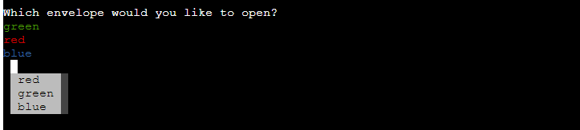
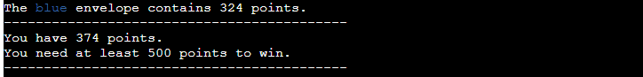
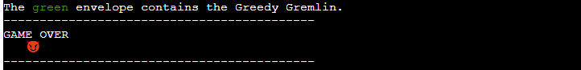
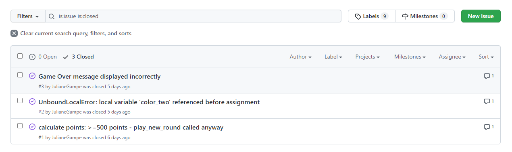

# Greedy Gremlin

Greedy Gremlin is a Python terminal game, which runs in the Code Institute mock terminal on Heroku.

The aim of the game is to collect 500 points. Users can choose to open one of three envelopes. One envelope will add points to the users score, one will subtract points and one envelope contains the Greedy Gremlin. Picking the envelope with the Gremlin will result in a Game Over as the Gremlin takes all the points for himself.


## How to Play

Greedy Gremlin was inspired by the German televion gameshow "Geh aufs Ganze!" You can read more about it on the German website of [Wikipedia](https://de.wikipedia.org/wiki/Geh_aufs_Ganze!) or about the American equivalent "Let's Make a Deal" on the English website of [Wikipedia](https://en.wikipedia.org/wiki/Let%27s_Make_a_Deal).

The aim of the Greedy Gremlin game is to collect 500 points. The player will start with an initial amount of 50 points.

They will be given a choice between three envelopes (red, green and blue). One of the envelopes will contain a number of positive points, which would be added to the players score. One envelope will contain a number of negative points, which would be deducted from the players score. The other envelope will contain the Greedy Gremlin, who will take all the points of the player and therefore result in a Game Over.

After the player chose their envelope, the content of one of the other two envelopes will be revealed. The player can then decide if they still want to open their envelope or if they want to skip the round at the cost of 50 points.

The game will be lost if the score of the player turns negative or if the envelope with the Greedy Gremlin is opened by the player.

## User Stories

- As a user I want to see the rules of the game, so that I know how to play it.
- As a user I want to be able to choose one of the envelopes.
- As a user I want to see the content of one of the other envelopes, so that I can decide if I want to proceed with openening my envelope or skip the round.
- As a user I want to see the content of my envelope and the result from opening it.
- As a user I want to be able to decide if I want to continue playing or not.

## Wireframes

A wireframe and flowchart created with Microsoft Word and Paint were used to plan the structure of the game.


## Features 

### Existing Features

- __Random assignment of a positive amount, negative amount and the Gremlin to the three envelopes__

  - A positive amount of points, a negative amount of points and the Gremlin are randomly assigned to the three envelopes (red, green and blue).

    ```python
        positive_amount = random.randint(250, 400)
        negative_amount = random.randint(-100, -20)
        greedy_gremlin = "Greedy Gremlin"

        envelope_content = [positive_amount, negative_amount, greedy_gremlin]
        content_one = random.choice(envelope_content)
        envelope_content.remove(content_one)
        content_two = random.choice(envelope_content)
        envelope_content.remove(content_two)
        content_three = envelope_content[0]
    ```
- __Game Instructions__

  - The user can choose to read the instructions of the game at the start.

    

- __Choosing an envelope and revelation of content of one of the other envelopes__

  - The player can choose one envelope and will be shown the content of one of the other envelopes.

    
    

- __Open or Skip__

  - The player can decide if they want to continue with opening their envelope or skip the round.

    

- __Result__

  - The result of the round is shown to the player.
    -  Result: total amount of points remains positive:
    
    - Result: total amount of points is negative:
    
    - Result: the envelope with the Greedy Gremlin was opened:
    
    - Result: 500 or more points, game won:
    

- __Continue or exit__ 

  - The player can decide if they want to continue playing or exit the game.
    - When the player has a positive amount of points left, but not won yet:
    
    - After a game over or win:
    


- __Input Validation and Error checking__

  - The player can only enter the suggested commands.
    - Possible command choices will be shown in the terminal.
    
    
    - An error message will display if the input is invalid.
    

### Future Features

- Choose the amount of envelopes you want to play with.
- Offer other choices apart from opening the envelope or skipping the round, like for example continue with opening boxes or goals. 

## Data Model

I decided to use an Envelope class as a model. The game creates three instances of the Envelope class to hold the three envelopes, that the player can choose from.

```python
    chosen_envelope = Envelope(color_one, content_one)
    second_envelope = Envelope(color_two, content_two)
    third_envelope = Envelope(color_three, content_three)
```

The Envelope class stores the color and the content of the envelopes. It has two methods to help play the game. The open method will open the envelope and return the content of the envelope. The skip method will skip the envelope and return a message, that the envelope will not be opened and 50 points will be deducted. 

```python
class Envelope:
    """
    Creates the envelopes
    Sets color, content
    Has a method to open the envelope and to skip the envelope
    """
    def __init__(self, color, content):
        self.color = color
        self.content = content

    def open(self):
        """
        Opens the envelope and reveals the content
        """
        sentence = ""
        if self.content == "Greedy Gremlin":
            sentence = f"the {self.content}."
        else:
            sentence = f"{self.content} points."
        return f"The {self.color} envelope contains {sentence}"

    def skip(self):
        """
        Displays the message that the envelope will not be opened
        Displays that 50 points are deducted
        """
        return ("You have chosen to skip the round.\n"
                "Your envelope will not be opened.\n"
                "50 points will now be deducted from your score.")

```
## Technologies Used

- [Python](https://www.python.org/) was used as programming language to develop the game.
- [Gitpod](https://www.gitpod.io/) was used for the developement of the game.
- [GitHub](https://github.com/) was used to store the code online.
- [The GitHub Projects Board](https://github.com/JulianeGampe/greedy-gremlin/projects/1) was used to keep track of tasks that are still to do or in progress or see tasks that are already done. Although the board was not entirely complete it provided a useful overview.
  
- [The GitHub Issues tracker](https://github.com/JulianeGampe/greedy-gremlin/issues) was used to keep track of bugs and add solutions.
  
- Git was used for version control.
- Microsoft Word and Paint were used to create the wireframe and flowchart.

### Python Packages
- [prompt-toolkit](https://pypi.org/project/prompt-toolkit/) - was used for prefilling the user selections
- [wcwidth](https://pypi.org/project/wcwidth/) - comes as part of the prompt-toolkit package
- [colorama](https://pypi.org/project/colorama/) - was used for adding color to the terminal

## Testing 

Due to the lengths of testing, you can see all tests in the [TESTING.md](TESTING.md) file.  

## Deployment

This project was deployed using Code Institute's mock terminal for Heroku.

- Steps for deployment
  - Create a new Heroku app

  
  

  - Add two buildpacks from the _Settings_ tab. The order is as follows:
      1. `heroku/python`
      2. `heroku/nodejs`
  
  
  

  - Create a _Config Var_ called `PORT`. Set this to `8000`

  

  - Link the Heroku app to the repository in the _Deploy_ tab

  
  
  

  - Click on Deploy

  
  

The live link can be found here -  https://greedy-gremlin.herokuapp.com/ 

### Local Deployment

If you would like to make a local copy of this repository, you can clone it by typing the following command in your IDE terminal:
- `git clone https://github.com/JulianeGampe/greedy-gremlin.git` 

Alternatively, if using Gitpod, you can click below to create your own workspace using this repository.

[](https://gitpod.io/#https://github.com/JulianeGampe/greedy-gremlin)

You must install the required Python packages for this application, using the command:
- `pip3 install -r requirements.txt`

## Credits 

- Code Institute for the deployment terminal.
- For inspiration of the game: "Geh aufs Ganze" on the [German Wikipedia Website](https://de.wikipedia.org/wiki/Geh_aufs_Ganze!) and the [English Wikipedia Website](https://en.wikipedia.org/wiki/Let%27s_Make_a_Deal) for the American equivalent "Let's Make a Deal".
- Information about the prompt_toolkit from the [PyPI website](https://pypi.org/project/prompt-toolkit/) and from [prompt_toolkit](https://python-prompt-toolkit.readthedocs.io/en/stable/pages/asking_for_input.html).
- Information about colorama from the [PyPI website](https://pypi.org/project/colorama/).
- Code to clear the screen in Python from [GeeksForGeeks](https://www.geeksforgeeks.org/clear-screen-python/0).
- "Greedy Gremlin" emoji from [Emojipedia](https://emojipedia.org/smiling-face-with-horns/).
- Trophy emoji from [Emojipedia](https://emojipedia.org/trophy/).
- [Am I responsive](http://ami.responsivedesign.is/) has been used to create the responsive mockup of the project.
