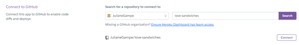

# Greedy Gremlin

Greedy Gremlin is a Python terminal game, which runs in the Code Institute mock terminal on Heroku.

The aim of the game is to collect 500 points. Users can choose to open one of three envelopes. One envelope will add points to the users score, one will subtract points and one envelope contains the Greedy Gremlin. Picking the envelope with the Gremlin will result in a Game Over as the Gremlin takes all the points for himself.

## How to Play

Greedy Gremlin was inspired by the German televion gameshow "Geh aufs Ganze!" You can read more about it on the German website of [Wikipedia](https://de.wikipedia.org/wiki/Geh_aufs_Ganze!) or about the American equivalent "Let's Make a Deal" on the English website of [Wikipedia](https://en.wikipedia.org/wiki/Let%27s_Make_a_Deal).

The aim of the Greedy Gremlin game is to collect 500 points. The player will start with an initial amount of 50 points.

They will be given a choice between three envelopes (red, green and blue). One of the envelopes will contain a number of positive points, which would be added to the players score. One envelope will contain a number of negative points, which would be deducted from the players score. The other envelope will contain the Greedy Gremlin, who will take all the points of the player and therefore result in a Game Over.

After the player chose their envelope, the content of one of the other two envelopes will be revealed. The player can then decide if they still want to open their envelope or if they want to skip the round at the cost of 50 points.

The game will be lost if the score of the player turns negative or if the envelope with the Greedy Gremlin is opened by the player.

## User Stories

- As a user I want to see the rules of the game, so that I know how to play it.
- As a user I want to be able to choose one of the envelopes.
- As a user I want to see the content of one of the other envelopes, so that I can decide if I want to proceed with openening my envelope or skip the round.
- As a user I want to see the content of my envelope and the result from opening it.
- As a user I want to be able to decide if I want to continue playing or not.

## Wireframes

A wireframe created with Microsoft Word was used to plan the structure of the game.

## Features 

### Existing Features

- __Random assignment of a positive amount, negative amount and the Gremlin to the three envelopes__

  - A positive amount of points, a negative a amount of points and the Gremlin are randomly assigned to the three envelopes (red, green and blue).

- __Choosing an envelope and revelation of content of one of the other envelopes__

  - The player can choose one envelope and will be shown the content of one of the other envelopes.

- __Open or Skip__

  - The player can decide if they want to continue with opening their envelope or skip the round.

- __Result__

  - The result of the round is shown to the player.

- __Continue or exit__ 

  - The player can decide if they want to continue playing or exit the game.

- __Input Validation and Error checking__

  - Player can only enter the suggested commands.
  - Possible command choices will be shown in the terminal.
  - An error message will display if the input is invalid.

### Future Features

- Choose the amount of envelopes you want to play with.
- Offer other choices apart from opening the envelope or skipping the round, like for example continue with opening boxes or goals. 

## Data Model

## Testing 

Due to the lengths of testing, you can see all tests in the [TESTING.md](TESTING.md) file.  

## Deployment

This project was deployed using Code Institute's mock terminal for Heroku.

- Steps for deployment
  - Create a new Heroku app

  
  

  - Add two buildpacks from the _Settings_ tab. The order is as follows:
      1. `heroku/python`
      2. `heroku/nodejs`
  
  
  

  - Create a _Config Var_ called `PORT`. Set this to `8000`

  

  - Link the Heroku app to the repository in the _Deploy_ tab

  
  
  

  - Click on Deploy

  
  

The live link can be found here -  https://greedy-gremlin.herokuapp.com/ 

### Local Deployment

If you would like to make a local copy of this repository, you can clone it by typing the following command in your IDE terminal:
- `git clone https://github.com/JulianeGampe/greedy-gremlin.git` 

You must install the required Python packages for this application, using the command:
- `pip3 install -r requirements.txt`

## Credits 

- Code Institute for the deployment terminal.
- For inspiration of the game: "Geh aufs Ganze" on the [German Wikipedia Website](https://de.wikipedia.org/wiki/Geh_aufs_Ganze!) and the [English Wikipedia Website](https://en.wikipedia.org/wiki/Let%27s_Make_a_Deal) for the American equivalent "Let's Make a Deal".
- Information about the prompt_toolkit from the [PyPI website](https://pypi.org/project/prompt-toolkit/) and from [prompt_toolkit](https://python-prompt-toolkit.readthedocs.io/en/stable/pages/asking_for_input.html).
- Information about colorama from the [PyPI website](https://pypi.org/project/colorama/).
- Code to clear the screen in Python from [GeeksForGeeks](https://www.geeksforgeeks.org/clear-screen-python/0).
- "Greedy Gremlin" emoji from [Emojipedia](https://emojipedia.org/smiling-face-with-horns/).
- Trophy emoji from [Emojipedia](https://emojipedia.org/trophy/).

Congratulations on completing your Readme, you have made another big stride in the direction of being a developer! 

## Other General Project Advice

Below you will find a couple of extra tips that may be helpful when completing your project. Remember that each of these projects will become part of your final portfolio so it’s important to allow enough time to showcase your best work! 

- One of the most basic elements of keeping a healthy commit history is with the commit message. When getting started with your project, read through [this article](https://chris.beams.io/posts/git-commit/) by Chris Beams on How to Write  a Git Commit Message 
  - Make sure to keep the messages in the imperative mood 

- When naming the files in your project directory, make sure to consider meaningful naming of files, point to specific names and sections of content.
  - For example, instead of naming an image used ‘image1.png’ consider naming it ‘landing_page_img.png’. This will ensure that there are clear file paths kept. 

- Do some extra research on good and bad coding practices, there are a handful of useful articles to read, consider reviewing the following list when getting started:
  - [Writing Your Best Code](https://learn.shayhowe.com/html-css/writing-your-best-code/)
  - [HTML & CSS Coding Best Practices](https://medium.com/@inceptiondj.info/html-css-coding-best-practice-fadb9870a00f)
  - [Google HTML/CSS Style Guide](https://google.github.io/styleguide/htmlcssguide.html#General)

Getting started with your Portfolio Projects can be daunting, planning your project can make it a lot easier to tackle, take small steps to reach the final outcome and enjoy the process! 

Welcome JulianeGampe,

This is the Code Institute student template for deploying your third portfolio project, the Python command-line project. The last update to this file was: **August 17, 2021**

## Reminders

* Your code must be placed in the `run.py` file
* Your dependencies must be placed in the `requirements.txt` file
* Do not edit any of the other files or your code may not deploy properly

## Creating the Heroku app

When you create the app, you will need to add two buildpacks from the _Settings_ tab. The ordering is as follows:

1. `heroku/python`
2. `heroku/nodejs`

You must then create a _Config Var_ called `PORT`. Set this to `8000`

If you have credentials, such as in the Love Sandwiches project, you must create another _Config Var_ called `CREDS` and paste the JSON into the value field.

Connect your GitHub repository and deploy as normal.

## Constraints

The deployment terminal is set to 80 columns by 24 rows. That means that each line of text needs to be 80 characters or less otherwise it will be wrapped onto a second line.

-----
Happy coding!