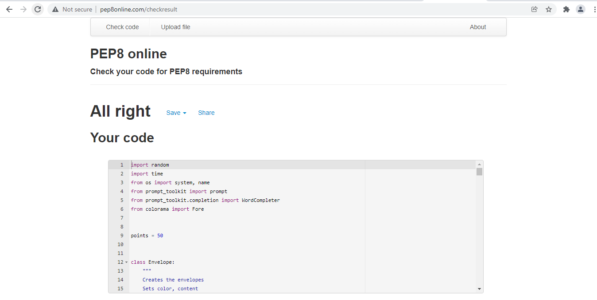
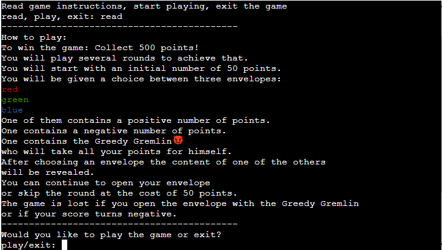
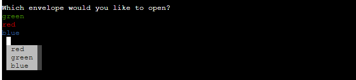
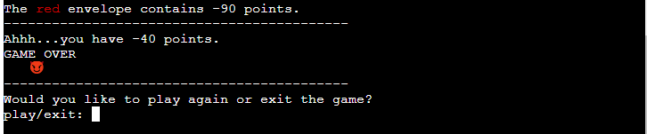
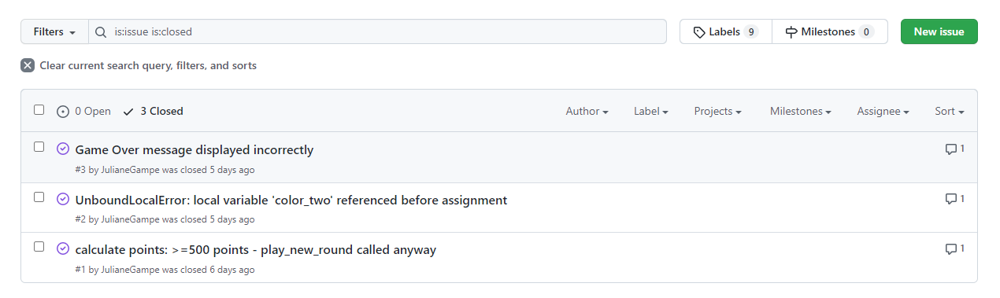

## Testing 

I have manually tested this project by doing the following:

- Confirmed that it is not possible to give invalid input.
  
- Tested in my local terminal and the Code Institute Heroku terminal

### Validator Testing 

- PEP8
  - No errors were returned from [PEP8online.com](http://pep8online.com/).
    

### Testing User Stories

- As a user I want to see the rules of the game, so that I know how to play it.
  
- As a user I want to be able to choose one of the envelopes.
  
- As a user I want to see the content of one of the other envelopes, so that I can decide if I want to proceed with openening my envelope or skip the round.

  
- As a user I want to see the content of my envelope and the result from opening it.
    -  Result: total amount of points remains positive:
    
    - Result: total amount of points is negative:
    
    - Result: the envelope with the Greedy Gremlin was opened:
    
    - Result: 500 or more points, game won:
    
- As a user I want to be able to decide if I want to continue playing or not.
    - When a positive amount of points is left, but not won yet:
    
    - After a game over or win:
     
      

### Fixed Bugs

The following bugs were tracked and fixed using the GitHub Issues tracker.

- **calculate points: >=500 points - play_new_round called anyway** - [#1](https://github.com/JulianeGampe/greedy-gremlin/issues/1)
- **UnboundLocalError: local variable 'color_two' referenced before assignment** - [#2](https://github.com/JulianeGampe/greedy-gremlin/issues/2)
- **Game Over message displayed incorrectly** - [#3](https://github.com/JulianeGampe/greedy-gremlin/issues/3)

### Remaining Bugs

- No remaining bugs that I am aware of.

---

Return to the [README](README.md) file
