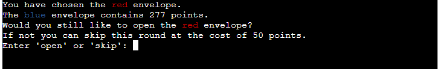

## Testing 

In this section, you need to convince the assessor that you have conducted enough testing to legitimately believe that the site works well. Essentially, in this part you will want to go over all of your project’s features and ensure that they all work as intended, with the project providing an easy and straightforward way for the users to achieve their goals.

In addition, you should mention in this section how your project looks and works on different browsers and screen sizes.

You should also mention in this section any interesting bugs or problems you discovered during your testing, even if you haven't addressed them yet.

If this section grows too long, you may want to split it off into a separate file and link to it from here.

### Validator Testing 

- HTML
  - No errors were returned when passing through the official [W3C validator]()
- CSS
  - No errors were found when passing through the official [(Jigsaw) validator]()

### Testing User Stories

- As a user I want to see the rules of the game, so that I know how to play it.
  
- As a user I want to be able to choose one of the envelopes.
  
- As a user I want to see the content of one of the other envelopes, so that I can decide if I want to proceed with openening my envelope or skip the round.

  
- As a user I want to see the content of my envelope and the result from opening it.
    -  Result: total amount of points remains positive:
    
    - Result: total amount of points is negative:
    
    - Result: the envelope with the Greedy Gremlin was opened:
    
    - Result: 500 or more points, game won:
    
- As a user I want to be able to decide if I want to continue playing or not.
    - When a positive amount of points is left, but not won yet:
    
    - After a game over or win:
    

### Unfixed Bugs

You will need to mention unfixed bugs and why they were not fixed. This section should include shortcomings of the frameworks or technologies used. Although time can be a big variable to consider, paucity of time and difficulty understanding implementation is not a valid reason to leave bugs unfixed. 
