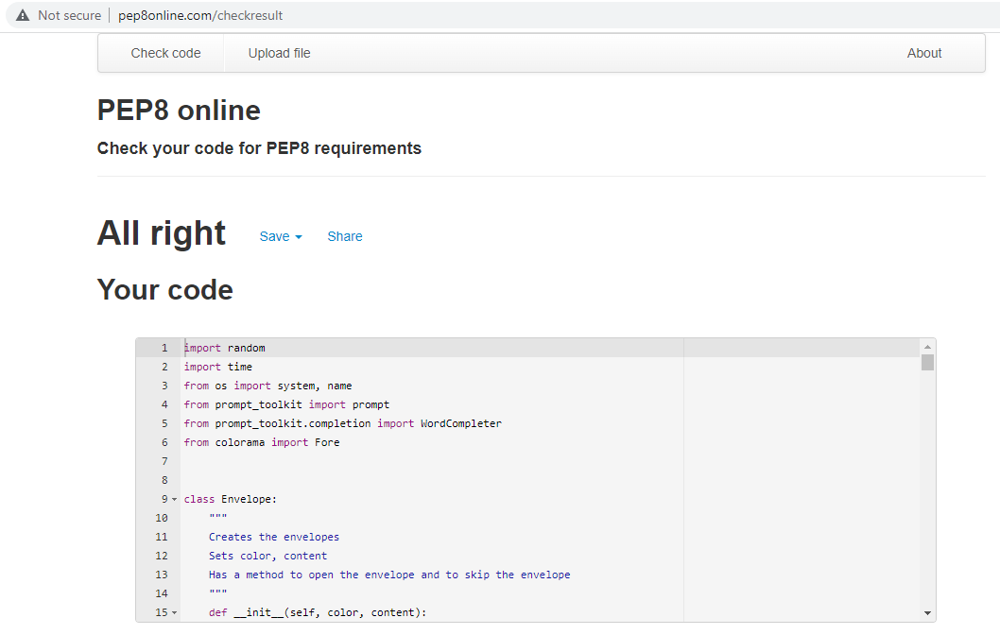
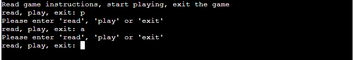

## Testing 

I have manually tested this project by doing the following:

- Passed the code through a PEP8 validation and confirmed there are no problems.
  
- Confirmed that it is not possible to give invalid input.
  
- Tested in my local terminal and the Code Institute Heroku terminal

### Validator Testing 

- HTML
  - No errors were returned when passing through the official [W3C validator]()
- CSS
  - No errors were found when passing through the official [(Jigsaw) validator]()

### Testing User Stories

- As a user I want to see the rules of the game, so that I know how to play it.
  
- As a user I want to be able to choose one of the envelopes.
  
- As a user I want to see the content of one of the other envelopes, so that I can decide if I want to proceed with openening my envelope or skip the round.

  
- As a user I want to see the content of my envelope and the result from opening it.
    -  Result: total amount of points remains positive:
    
    - Result: total amount of points is negative:
    
    - Result: the envelope with the Greedy Gremlin was opened:
    
    - Result: 500 or more points, game won:
    
- As a user I want to be able to decide if I want to continue playing or not.
    - When a positive amount of points is left, but not won yet:
    
    - After a game over or win:
    

### Unfixed Bugs

You will need to mention unfixed bugs and why they were not fixed. This section should include shortcomings of the frameworks or technologies used. Although time can be a big variable to consider, paucity of time and difficulty understanding implementation is not a valid reason to leave bugs unfixed. 
